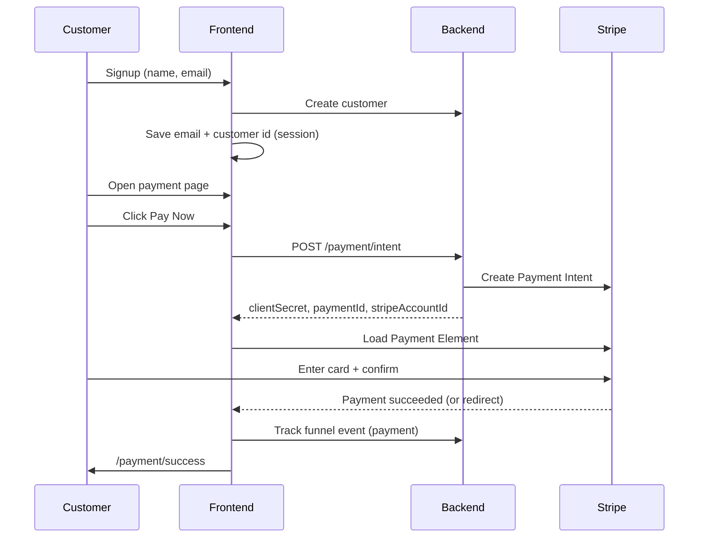

# How Stripe Payment Works in RetentionPlus

This guide explains, in simple terms, how a customer pays in the funnel and how Stripe fits in. It describes what this **frontend** app does; your **backend API** creates the real charge on Stripe.

---

## The customer journey (4 steps)

1. **Landing** — Customer sees your offer page and taps continue.
2. **Signup** — Customer enters name and email. The app saves them and sends the customer to payment.
3. **Payment** — Customer pays with Stripe (card, etc.) on the payment page.
4. **Success** — Customer sees a thank-you page after payment succeeds.

Public URLs look like:

- `/funnel/{funnelId}/landing`
- `/funnel/{funnelId}/signup?campaignId=…&restaurantId=…`
- `/funnel/{funnelId}/payment?campaignId=…&restaurantId=…`
- `/payment/success` (after Stripe finishes)

---

## Big picture: who does what?

| Part | Role |
|------|------|
| **Your backend** (`POST /payment/intent`) | Creates a Stripe Payment Intent, knows the restaurant, fee, and amount. Returns a `clientSecret` (and often `stripeAccountId` for Connect). |
| **This frontend** | Shows the payment page, asks the backend for that secret, loads Stripe’s UI, confirms payment with Stripe. |
| **Stripe** | Securely collects card details and processes the payment. |
| **Browser session storage** | Remembers email, customer id, and payment id between signup and payment (same browser tab/session). |

The frontend **never** stores full card numbers. Stripe’s **Payment Element** handles card data inside Stripe’s iframe.

---

## Step-by-step: what happens at payment

### Before payment (signup)

When the customer completes signup:

1. The app calls your API to **create a customer** (name + email).
2. It saves in **session storage**:
   - Email → used on the payment page
   - Customer id → used for analytics / tracking
3. The customer is redirected to the **payment** step.

Relevant code: `TemplatePreview.tsx` (signup submit), `app/lib/funnel-checkout-storage.ts`.

### Opening the payment page

Route: `app/(routes)/funnel/[campaignId]/payment/page.tsx`

The page needs:

- **Email** from signup (session storage). If missing, Stripe checkout is not started (user sees a hint to complete signup first).
- **Funnel id** from the URL (`/funnel/123/...` → funnel id `123`).
- **Restaurant id** from the query `?restaurantId=…` or env `NEXT_PUBLIC_FUNNEL_PAYMENT_RESTAURANT_ID`.

Optional query/env:

- `currency` (default `usd`)
- `applicationFeeAmount` (platform fee in smallest currency unit, e.g. cents; default from `NEXT_PUBLIC_FUNNEL_PAYMENT_APPLICATION_FEE` or `200`)

These are passed into `TemplatePreview` as `paymentStripeCheckout`.

### “Pay Now” → Payment Intent

Component: `app/components/funnel/FunnelStripePaymentForm.tsx`

1. User clicks **Pay Now**.
2. Frontend calls **`createPaymentIntent`** → `POST {API}/payment/intent` with:
   - `funnelId`
   - `restaurantId`
   - `applicationFeeAmount`
   - `currency`
   - `customerEmail`
3. Backend responds with:
   - **`clientSecret`** — required to show Stripe’s payment form
   - **`paymentId`** — saved in session storage for tracking
   - **`stripeAccountId`** (optional) — if the restaurant uses **Stripe Connect**, payments go to their connected account

4. Frontend loads Stripe.js with:
   - `NEXT_PUBLIC_STRIPE_PUBLISHABLE_KEY`
   - Connected account id when provided

### Enter card and pay

Component: `app/components/funnel/CheckoutForm.tsx`

1. Stripe **Elements** wraps a **Payment Element** (card fields).
2. User clicks **Complete Payment**.
3. Frontend calls `stripe.confirmPayment()` with:
   - **Return URL**: `/payment/success?funnelId=…`
   - **`redirect: "if_required"`** — only redirects if Stripe needs 3D Secure or similar

4. If payment succeeds immediately:
   - App tracks a **payment** funnel event (paid).
   - Browser goes to `/payment/success?funnelId=…&redirect_status=succeeded`.

5. If Stripe needs a redirect (e.g. bank authentication), the customer returns to the same success URL after Stripe finishes.

### Success page

Route: `app/(routes)/payment/success/page.tsx`

- Shows “Payment submitted”.
- If `redirect_status=succeeded`, sends another **payment** tracking event (backup if the first track did not run).

---

## Flow diagram

---

## Restaurant owners: Stripe Connect

Restaurants connect their own Stripe account so charges can go to them (with an application fee for the platform).

- **Connect flow**: `connectStripe()` → `POST {API}/stripe/connect/{restaurantId}` → user is sent to Stripe’s onboarding URL.
- **Settings UI**: `RestaurantSettingsDialog.tsx` (and related Stripe success routes).

After Connect, the backend can return `stripeAccountId` on the payment intent; the frontend passes it to `loadStripe(publishableKey, { stripeAccount })`.

---

## Editor vs live funnel

| Mode | Payment behavior |
|------|------------------|
| **Template editor preview** | Can use test email/fees from env (`NEXT_PUBLIC_FUNNEL_PAYMENT_PREVIEW_EMAIL`, etc.) in `CrmTemplateEditor.tsx`. |
| **Live funnel** (`/funnel/.../payment`) | Real Stripe flow when publishable key is set and signup + restaurant id are present. |

`PaymentPagePreview.tsx` shows a **fake** card form in the editor when Stripe is not active. On the live payment page with Stripe configured, it renders **`FunnelStripePaymentForm`** instead.

---

## Environment variables (frontend)

| Variable | Purpose |
|----------|---------|
| `NEXT_PUBLIC_API_URL` | Backend base URL for `/payment/intent` and other APIs |
| `NEXT_PUBLIC_STRIPE_PUBLISHABLE_KEY` | Stripe publishable key (starts with `pk_`) |
| `NEXT_PUBLIC_FUNNEL_PAYMENT_RESTAURANT_ID` | Default restaurant id when URL has no `restaurantId` |
| `NEXT_PUBLIC_FUNNEL_PAYMENT_APPLICATION_FEE` | Default platform fee (e.g. `200` = $2.00 in USD cents) |
| `NEXT_PUBLIC_FUNNEL_PAYMENT_CURRENCY` | Default currency (e.g. `usd`) |
| `NEXT_PUBLIC_FUNNEL_PAYMENT_PREVIEW_EMAIL` | Email used in editor Stripe preview |

See `.env.example` for a minimal sample.

---

## Important files (quick reference)

| File | What it does |
|------|----------------|
| `app/(routes)/funnel/[campaignId]/payment/page.tsx` | Live payment page; builds Stripe context |
| `app/components/funnel/FunnelStripePaymentForm.tsx` | Pay Now → intent → Stripe Elements |
| `app/components/funnel/CheckoutForm.tsx` | Payment Element + confirm payment |
| `app/services/payment/create-payment-intent.ts` | API call to create intent |
| `app/lib/funnel-checkout-storage.ts` | Email, customer id, payment id in session |
| `app/(routes)/payment/success/page.tsx` | Thank-you page + tracking |
| `app/components/crm-template-editor/PaymentPagePreview.tsx` | Payment page layout + embeds Stripe form |
| `app/services/stripe/connect-stripe.ts` | Start restaurant Stripe Connect |

---

## Tracking and reporting

After a successful payment, the frontend calls **`trackFunnelEvent`** with:

- `eventType: "payment"`
- `paymentStatus: "paid"`
- `funnelId`, `funnelPaymentId`, `visitorId`, and optionally `customerId`

Used in `CheckoutForm.tsx` and `payment/success/page.tsx`. Dashboard panels (e.g. funnel orders) read payment data from your backend APIs such as `get-funnel-payments.ts`.

---

## Common issues

| Symptom | Likely cause |
|---------|----------------|
| “Complete signup first” | No email in session storage — do signup in the same browser session first |
| “Add restaurantId…” | Missing `?restaurantId=` and no `NEXT_PUBLIC_FUNNEL_PAYMENT_RESTAURANT_ID` |
| “Payments are not configured” | Missing `NEXT_PUBLIC_STRIPE_PUBLISHABLE_KEY` |
| Pay Now fails | Backend `/payment/intent` error, or restaurant not connected to Stripe |
| Editor shows fake card fields | Normal in preview; live URL needs Stripe env + signup + restaurant id |

---

## Summary

Stripe payment in this app is **Payment Intents + Payment Element**: the **backend** creates the intent and tells Stripe which restaurant and fee to use; the **frontend** only uses the `clientSecret` to show Stripe’s form and confirm payment. Signup supplies the customer email; session storage links signup to payment; the success page confirms completion and records analytics.

For backend rules (amounts, Connect accounts, webhooks), refer to your API service documentation—the frontend depends on `POST /payment/intent` returning a valid `clientSecret`.
